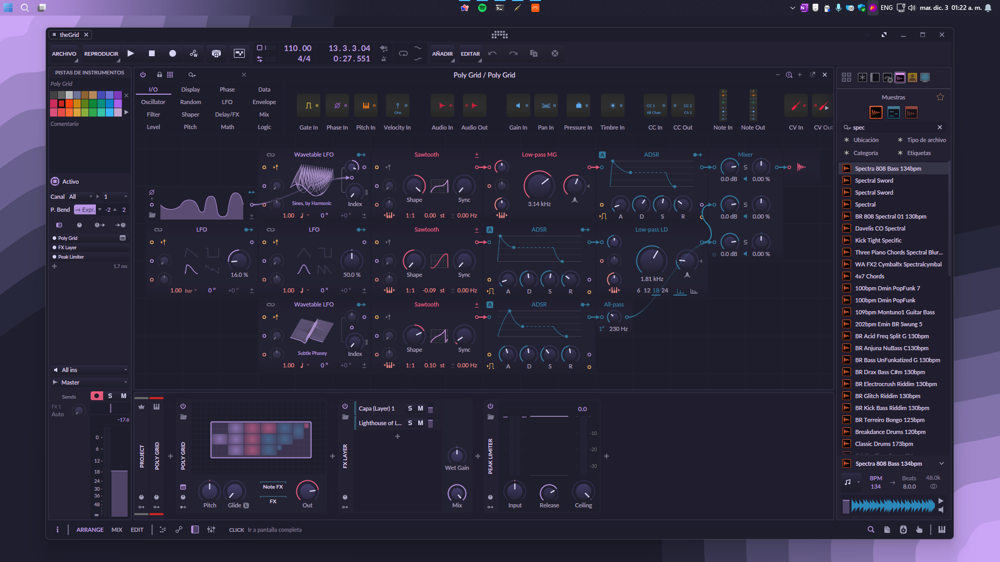

# RosePineMoon_Bitwig

Este tema esta inspirado en la paletta de colores [RosePine Moon](https://rosepinetheme.com/palette/ingredients/)

# Instalacion 
- Siga los pasos recomendados por [Berikai](https://github.com/Berikai/bitwig-theme-editor.git)
- Descargue el archivo 'rosePineMoon.json'

# Capturas
Configuracion de las capturas en bitwig
- Medios tonos: 4%
- Nivel de negro: 92%
- Lineas de la rejilla: 31%

# Nota
Agregará correciones a medida que yo lo use, por ahora hay algunos problemas que lo solucionaré a futuro. Por ejemplo los lineas del pianoroll no se aprecian lo solucionar pronto entro otras cosas pequeñas. 😊
